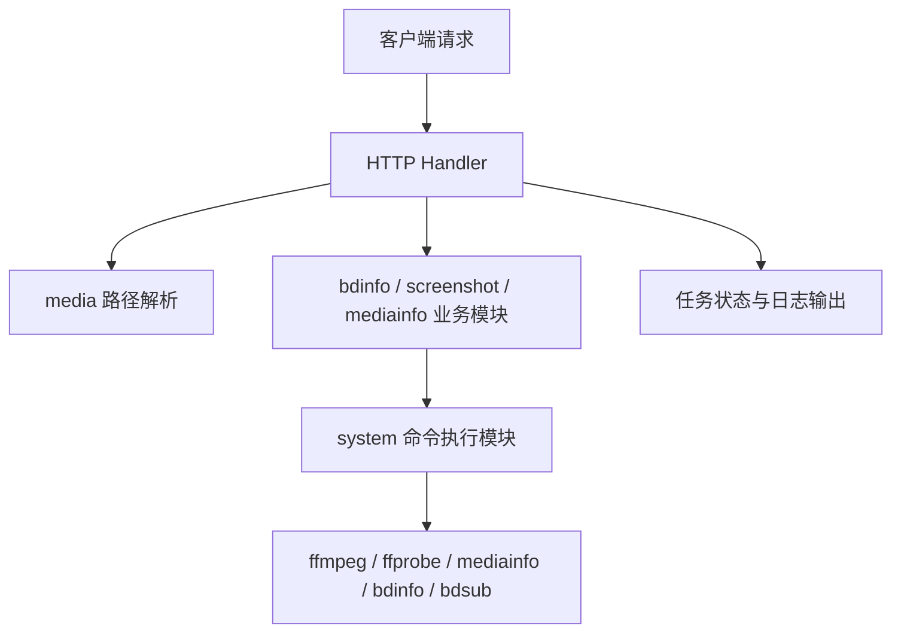

# minfo 后端源码说明文档

## 1. 文档范围

本文档仅覆盖后端实现，包括：

- Go 服务入口与应用装配
- HTTP 路由、请求处理、任务管理与实时日志机制
- 媒体路径解析、ISO 挂载与媒体源归一化
- `MediaInfo`、`BDInfo`、截图与图床上传相关后端逻辑
- `tools/bdsub_probe.c` 蓝光字幕辅助探针

本文档不包含前端页面、构建脚本、容器编排与发布流程。

---

## 2. 系统概述

`minfo` 后端提供一组面向本地媒体分析的 HTTP 接口，主要功能如下：

- 输出 `MediaInfo`
- 输出 `BDInfo`
- 生成截图并打包下载
- 生成截图并上传图床
- 浏览媒体目录
- 推送实时任务日志

系统本身并不直接承担底层媒体解析工作，而是对外部工具进行统一编排。其核心职责包括：

1. 接收并校验请求参数
2. 将输入路径解析为具体可处理的媒体源
3. 调用外部工具完成媒体分析或截图生成
4. 对输出结果进行结构化整理
5. 通过同步响应、后台任务或实时日志向客户端返回结果

---

## 3. 后端目录结构

```text
cmd/minfo/main.go              程序入口
internal/app                   HTTP Server 组装
internal/config                运行时配置
internal/httpapi               路由、handler、中间件、日志流、传输结构
internal/media                 路径浏览、ISO 挂载、媒体源解析
internal/system                外部命令执行
internal/bdinfo                BDInfo 调用与报告整理
internal/screenshot            截图、字幕选择、时间对齐、图床上传
internal/version               版本号注入
tools/bdsub_probe.c            蓝光 PG 字幕辅助探针
```

---

## 4. 后端总体调用关系



该架构的关键特征在于：所有复杂输入形式都会先进入 `media` 模块完成归一化，之后再进入具体业务模块。这样可以将“路径解析”与“媒体处理”解耦。

---

## 5. 核心流程

## 5.1 服务启动流程

```text
main
-> app.NewServer
-> httpapi.NewHandler
-> 注册路由
-> ListenAndServe
```

该流程的两个关键点如下：

- 启动时会尝试自动加载 `udf` 内核模块，以支持后续 ISO 挂载。
- 路由层在统一入口处完成中间件装配，包括访问日志与 Basic Auth。

## 5.2 信息类任务流程

```text
HTTP 请求
-> handler 解析输入
-> media 选择探测源
-> 调用 mediainfo 或 bdinfo
-> 整理文本输出
-> 返回同步结果或后台任务结果
```

信息类任务分为两类：

- `MediaInfo`
- `BDInfo`

二者共享相似的任务生命周期管理逻辑，包括任务创建、状态轮询、取消与超时控制。

## 5.3 截图任务流程

```text
HTTP 请求
-> 解析截图输入源
-> 探测时长并生成随机时间点
-> 选择字幕源
-> 对齐截图时间点
-> 调用 ffmpeg 截图
-> ZIP 下载 或 图床上传
```

截图链路是后端复杂度最高的部分，其核心难点不在于抓帧本身，而在于：

- 支持普通视频、蓝光目录、DVD、ISO 等多种输入形式
- 支持外挂字幕、内封文字字幕、内封位图字幕
- 通过字幕出现区间对齐截图时间点
- 对位图字幕执行可见性验证，避免截到无字幕帧

---

## 6. 模块说明

## 6.1 入口与应用装配

### `cmd/minfo/main.go`

该文件为程序入口。`main` 函数完成如下工作：

1. 调用 `app.NewServer` 创建 `http.Server`
2. 将嵌入的静态资源文件系统传入服务装配层
3. 输出版本号与监听地址
4. 调用 `ListenAndServe` 启动服务

### `internal/app/app.go`

`NewServer` 是服务装配入口，其职责包括：

- 读取监听端口配置
- 在服务启动前尝试加载 `udf` 内核模块
- 从嵌入文件系统中提取 `webui/dist`
- 构造并返回 `http.Server`

### `assets.go`

该文件负责提供嵌入式静态文件系统入口。虽然本文档不讨论前端实现，但后端在启动时依赖该文件向浏览器提供静态资源，因此保留说明。

---

## 6.2 路由与 HTTP 处理

### `internal/httpapi/router.go`

`NewHandler` 负责注册全部 HTTP 接口，并装配中间件。核心接口包括：

- `/api/mediainfo`
- `/api/bdinfo`
- `/api/info-jobs`
- `/api/screenshot-jobs`
- `/api/screenshots`
- `/api/path`

### `internal/httpapi/middleware/auth.go`

该文件包含两个中间件：

- `Logging`：记录请求方法、路径与耗时
- `Authenticate`：在配置 `WEB_PASSWORD` 后启用 Basic Auth

认证逻辑使用常量时间比较，以避免简单的时序泄漏问题。

### `internal/httpapi/transport/request.go`

该文件承担请求解析相关的公共逻辑，重点包括：

- `EnsurePost`：统一校验 POST 请求
- `ParseForm`：限制上传大小并解析 multipart 表单
- `CleanupMultipart`：清理 multipart 产生的临时文件
- `InputPath`：从 `path` 或上传文件中解析输入源

### `internal/httpapi/transport/response.go`

该文件负责统一输出 JSON 响应，避免各 handler 重复编写响应编码逻辑。

---

## 6.3 请求处理与任务机制

### `internal/httpapi/handlers/info.go`

该文件提供同步信息类接口，核心函数如下：

- `MediaInfoHandler`
- `BDInfoHandler`
- `runMediaInfo`
- `runBDInfo`

其中：

- `runMediaInfo` 会先调用 `media.ResolveMediaInfoCandidates` 生成候选文件列表，再按顺序执行 `mediainfo`
- `runBDInfo` 会调用 `bdinfo.Run` 生成报告，并按请求模式输出精简版或完整版

### `internal/httpapi/handlers/info_jobs.go`

该文件提供信息类后台任务能力。其内部维护 `infoJob` 对象和全局任务表，支持：

- 创建任务
- 查询任务状态
- 取消任务
- TTL 到期清理

状态机包括：

- `pending`
- `running`
- `canceling`
- `succeeded`
- `failed`
- `canceled`

### `internal/httpapi/handlers/screenshots.go`

该文件提供截图相关同步接口，包括：

- 即时生成 ZIP 并直接下载
- 预生成 ZIP，返回下载 token
- 执行截图并上传图床

### `internal/httpapi/handlers/screenshot_jobs.go`

该文件提供截图后台任务能力。其设计与 `info_jobs.go` 基本一致，但任务结果分为两类：

- 文本输出（图床直链）
- 下载地址（ZIP 文件）

---

## 6.4 媒体路径解析模块

### 模块职责

`internal/media` 是整个后端的关键基础模块。该模块负责将多种输入形式转换为业务模块真正需要的“探测源”。

支持的输入类型包括：

- 普通视频文件
- 蓝光目录
- DVD 目录
- ISO 文件
- ISO 内部虚拟路径
- 上传到临时目录的文件

### `internal/media/virtual_paths.go`

该文件实现 `ISO:/path/to.iso!/inner/path` 形式的虚拟路径协议，主要职责包括：

- 识别虚拟 ISO 路径
- 解析 ISO 文件路径与内部路径
- 挂载 ISO
- 将虚拟路径映射为挂载目录中的真实路径

### `internal/media/mount.go`

该文件负责 ISO 挂载与卸载，核心逻辑包括：

- 自动定位 `mount`、`umount`、`modprobe`
- 创建临时挂载目录
- 执行 `mount -o loop,ro`
- 在 UDF 文件系统缺失时尝试自动 `modprobe udf`
- 构造延迟清理函数

### `internal/media/resolver.go`

该文件是媒体路径归一化的核心实现，主要函数包括：

- `ResolveScreenshotSource`
- `ResolveMediaInfoCandidates`
- `ResolveDVDMediaInfoSource`
- `ResolveBDInfoSource`

不同业务对“输入路径”的要求不同，因此该文件会根据业务类型选择不同的解析策略。例如：

- 截图更倾向于获得具体视频文件
- `MediaInfo` 更适合对文件本身执行探测
- `BDInfo` 更适合获得蓝光根目录

### `internal/media/paths.go`

该文件面向路径浏览接口，负责：

- 根据根目录与前缀列出目录项
- 对普通目录与 ISO 虚拟目录分别处理
- 为前端返回目录、文件与文件大小信息

### `internal/media/roots.go`

该文件负责自动检测媒体根目录。其实现会读取 `/proc/self/mountinfo`，过滤掉系统文件系统，只保留适合媒体浏览的顶层挂载点。

---

## 6.5 外部命令执行模块

### `internal/system/exec.go`

该文件对外部命令执行进行了统一封装，主要提供两类能力：

- 完整收集 stdout/stderr
- 在执行过程中按行转发实时输出

常用函数包括：

- `ResolveBin`
- `RunCommand`
- `RunCommandInDir`
- `RunCommandLive`
- `RunCommandInDirLive`

该模块的几个重要设计点如下：

- 为命令创建独立进程组
- 在上下文取消或超时时终止整个进程组
- 支持实时逐行日志回调
- 保留完整 stdout/stderr，便于错误拼接

### `internal/system/process_linux.go`

该文件仅在 Linux 下生效，用于：

- 设置子进程组
- 在取消或超时时结束整个进程组

---

## 6.6 BDInfo 模块

### `internal/bdinfo/service.go`

该模块负责组织 `bdinfo` 的完整执行流程，包括：

1. 解析蓝光输入源
2. 准备工作目录
3. 在需要时使用 bind mount 或软链接包装输入目录
4. 构造命令参数
5. 执行 `bdinfo`
6. 查找报告文件
7. 读取并返回报告内容

其中最关键的入口函数为：

- `Run`

### `internal/bdinfo/report.go`

该文件负责整理 `bdinfo` 输出文本，核心逻辑包括：

- `ExtractCodeBlock`：从 `[code]...[/code]` 中提取最有代表性的代码块
- `SelectLargestPlaylistBlock`：从完整报告中筛选最大播放列表块

---

## 6.7 截图模块

### 模块职责

`internal/screenshot` 是后端复杂度最高的模块。其实现并不局限于抓帧，而是完整覆盖以下能力：

- 时长探测
- 随机时间点生成
- 字幕源选择
- 截图时间点对齐
- 位图字幕可见性验证
- 真正执行截图
- 图片打包与图床上传

### `internal/screenshot/service.go`

该文件是截图模块对外入口，主要负责：

- 规范化模式、格式、字幕选项和截图数量
- 探测媒体时长
- 生成随机截图时间点
- 调用引擎执行截图或上传

### `internal/screenshot/engine.go`

该文件定义了 `screenshotRunner` 及截图主流程。其职责包括：

- 创建运行器上下文
- 初始化二进制路径、字幕状态、视频参数
- 驱动单轮截图任务的执行

### `internal/screenshot/subtitle_selection.go`

该文件负责字幕选择逻辑。大致优先级如下：

1. 外挂字幕
2. 内封字幕
3. 蓝光额外元数据补充
4. DVD `mediainfo` 元数据补充

对于蓝光场景，该文件会结合：

- `ffprobe`
- `bdsub`
- payload/bitrate 信息

来确定最适合截图的字幕轨。

### `internal/screenshot/subtitle_alignment.go`

该文件负责截图时间点与字幕时间的对齐。其主要策略包括：

- 局部窗口探测
- 扩大窗口重试
- 基于全片字幕索引进行回退
- 对位图字幕执行可见性验证
- 进行秒级去重，避免重复截图

### `internal/screenshot/capture.go`

该文件负责具体截图实现，核心工作包括：

- 按时间点调用 `ffmpeg`
- 对文字字幕使用 `subtitles=` filter
- 对位图字幕使用 `overlay`
- 对超大图片执行重拍或重编码

### `internal/screenshot/pixhost_upload.go`

该文件负责将截图上传到 Pixhost，并输出整理后的直链结果。

### `internal/screenshot/dvd_mediainfo.go`

该文件用于解析 DVD 场景下的 `mediainfo --Output=JSON` 结果，以补充字幕语言和轨道信息。

---

## 6.8 实时任务与截图模块中最值得优先阅读的函数

为便于源码阅读，建议优先关注以下函数：

### 路由与请求处理

- `main`
- `app.NewServer`
- `httpapi.NewHandler`
- `handlers.MediaInfoHandler`
- `handlers.BDInfoHandler`
- `handlers.ScreenshotsHandler`
- `handlers.InfoJobsHandler`
- `handlers.ScreenshotJobsHandler`

### 路径解析

- `transport.InputPath`
- `media.ResolveInputPath`
- `media.ResolveScreenshotSource`
- `media.ResolveMediaInfoCandidates`
- `media.ResolveBDInfoSource`
- `media.mountISO`

### 外部工具调度

- `system.ResolveBin`
- `system.RunCommand`
- `system.RunCommandLive`
- `system.RunCommandInDirLive`

### BDInfo

- `bdinfo.Run`
- `bdinfo.SelectLargestPlaylistBlock`
- `bdinfo.ExtractCodeBlock`

### 截图

- `screenshot.RunScreenshotsWithLiveLogs`
- `screenshot.runEngineScreenshotsWithLiveLogs`
- `screenshot.runScreenshotsFromSource`
- `(*screenshotRunner).init`
- `(*screenshotRunner).chooseSubtitle`
- `(*screenshotRunner).alignToSubtitle`
- `(*screenshotRunner).captureScreenshot`
- `runPixhostUploadWithLiveLogs`

---

## 7. `tools/bdsub_probe.c` 模块说明

### 7.1 模块职责

`tools/bdsub_probe.c` 是蓝光 PG 字幕辅助探针。该工具并不负责截图本身，而是为字幕选轨提供更稳定的辅助元数据。

其输出内容主要包括：

- `PID`
- 语言码
- 编码类型
- `payload_bytes`
- `bitrate`

### 7.2 执行流程

```text
main
-> parse_mpls_streams
-> parse_clpi_streams
-> 按需扫描 m2ts
-> 输出 JSON
```

### 7.3 关键函数

建议优先阅读以下函数：

- `main`
- `parse_mpls_streams`
- `parse_clpi_streams`
- `probe_result_scan_clip_pg_payload_bytes`
- `probe_result_scan_clip_pg_bitrates`
- `print_probe_result_json`

### 7.4 该工具在系统中的作用

在蓝光场景下，单独依赖 `ffprobe` 可能无法稳定获得足够准确的字幕语言与优先级信息。尤其在“同语言多条 PGS 字幕轨”场景下，仍需要额外的密度指标进行排序。该探针即用于补充这一部分信息。

---

## 8. 建议阅读顺序

建议按以下顺序阅读源码：

1. `cmd/minfo/main.go`
2. `internal/app/app.go`
3. `internal/httpapi/router.go`
4. `internal/httpapi/handlers/info.go`
5. `internal/httpapi/handlers/screenshots.go`
6. `internal/httpapi/handlers/info_jobs.go`
7. `internal/httpapi/handlers/screenshot_jobs.go`
8. `internal/media/resolver.go`
9. `internal/system/exec.go`
10. `internal/bdinfo/service.go`
11. `internal/screenshot/service.go`
12. `internal/screenshot/engine.go`
13. `internal/screenshot/subtitle_selection.go`
14. `internal/screenshot/subtitle_alignment.go`
15. `internal/screenshot/capture.go`
16. `tools/bdsub_probe.c`

---

## 9. 结论

`minfo` 后端的核心价值在于：将复杂输入路径解析、外部媒体工具调度、字幕选轨、截图时间对齐和任务日志机制整合为一套可自动执行的媒体分析流水线。其系统复杂度主要集中于两个方面：

- 输入源归一化
- 字幕驱动的截图执行链路

从维护与扩展角度看，`internal/media` 与 `internal/screenshot` 是最关键的两个模块；从系统联动角度看，`system`、`bdinfo` 与 `tools/bdsub_probe.c` 是保障外部工具协同工作的基础。
